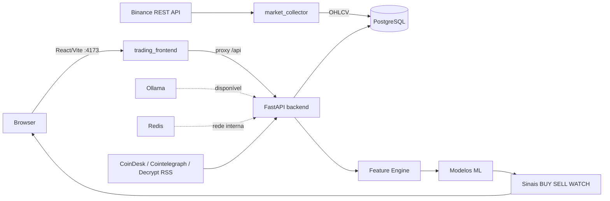
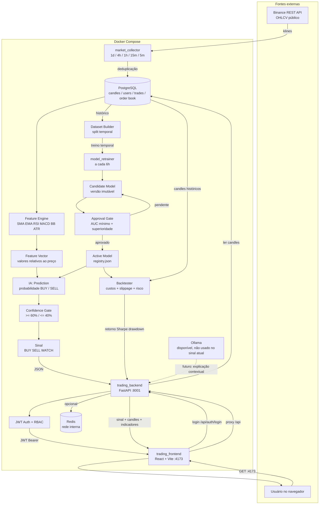
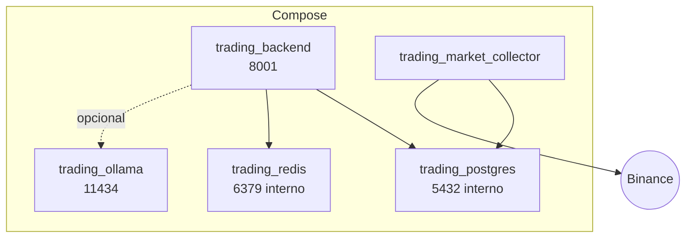
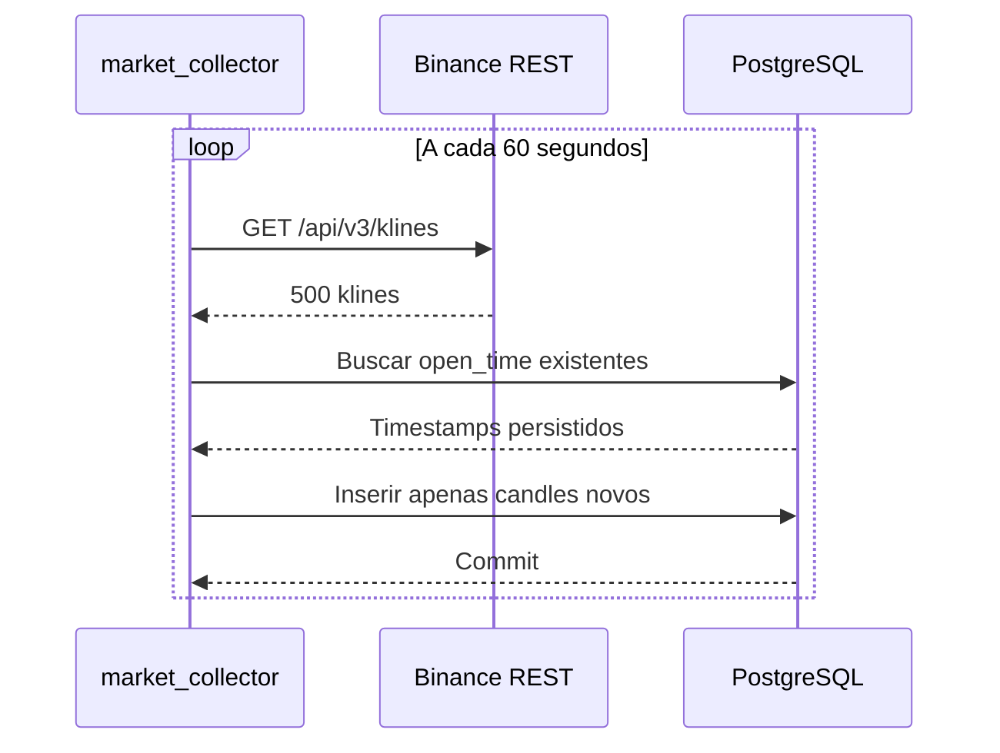
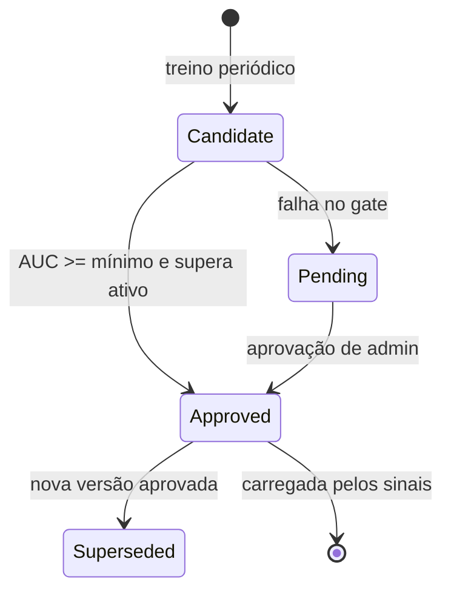
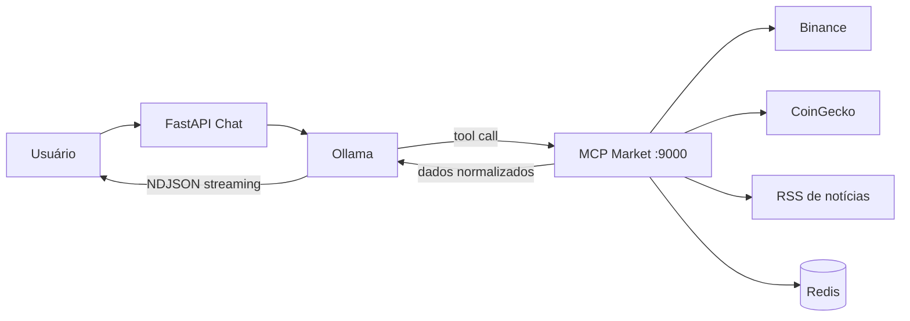
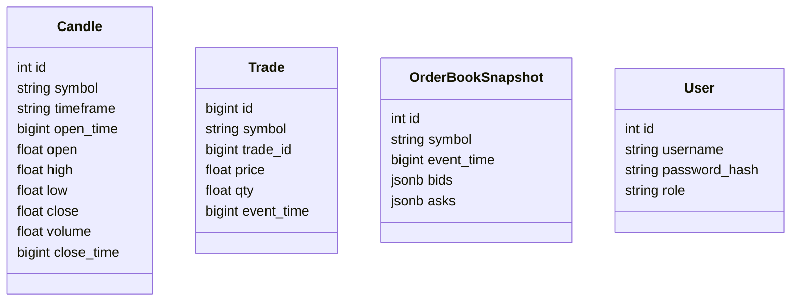

# Arquitetura do Trade AI

Este documento descreve a arquitetura implementada atualmente no repositório. O sistema é executado integralmente em Docker Compose e está em modo de análise/paper trading.

## Sumário

- Visão geral
- Componentes e responsabilidades
- Fluxo de dados de mercado
- Autenticação e autorização
- Feature Engine e ML
- Dashboard
- Persistência
- Deployment e estabilidade
- Limitações e próximos passos

## Visão geral



O collector busca candles públicos da Binance a cada 60 segundos. O backend lê candles, calcula indicadores, carrega modelos persistidos e entrega sinais ao dashboard.

## Fluxo completo de dados

O ponto de maior valor da IA está no bloco `Prediction`: depois que os candles foram coletados, persistidos e transformados em features, o modelo estima a probabilidade de alta ou baixa. O resultado ainda passa por um filtro de confiança antes de virar `BUY`, `SELL` ou `WATCH`.



### Onde a IA ajuda

1. `Feature Engine` prepara o estado quantitativo do mercado.
2. `Prediction` estima a probabilidade de movimento usando o modelo ativo.
3. `Confidence Gate` evita transformar baixa convicção em sinal operacional.
4. `model_retrainer` procura versões melhores com dados novos.
5. `Backtester` mede se a previsão teria gerado resultado depois de taxa, slippage e drawdown.

### Onde a IA ainda não atua

- O collector apenas transporta e persiste dados.
- O dashboard apenas apresenta dados e sinais.
- O backtester não aprende; ele avalia uma estratégia.
- Ollama está disponível, mas ainda não participa da decisão quantitativa.
- Nenhuma ordem é enviada para a Binance.

## Componentes

| Componente | Implementação | Responsabilidade |
| --- | --- | --- |
| API | `app/main.py` | FastAPI, rotas e arquivos web |
| Autenticação | `app/auth.py`, `app/api/login.py` | JWT Bearer e roles |
| Collector | `app/market/candle_sync.py` | Sincronização de candles Binance |
| Adapter | `app/market/binance_adapter.py` | Cliente REST da Binance |
| Banco | `app/db/engine.py`, `app/db/models.py` | SQLAlchemy async e PostgreSQL |
| Features | `app/ml/features.py` | Indicadores e features relativas ao preço |
| Dataset | `app/ml/dataset.py` | Labels e divisão temporal |
| Modelos | `app/ml/models.py` | Treino, avaliação, previsão e persistência |
| Sinais | `app/api/signals.py` | Sinal atual baseado no modelo |
| Backtester | `app/ml/backtester.py`, `app/api/backtest.py` | Simulação causal com custos e risco |
| Frontend | `frontend/src/` | React/Vite modular, login, indicadores e gráfico OHLC |

## Serviços Docker



Serviços atuais:

- `backend`: Uvicorn sem `--reload`, porta publicada `8001`.
- `frontend`: Vite React TypeScript, porta publicada `4173`, com proxy `/api` para o backend.
- `news`: endpoint REST autenticado que lê feeds RSS públicos, aplica cache Redis e atende a página `/news`.

A aplicação React é organizada por responsabilidade:

- `components/`: `LoginScreen`, `MarketDesk`, `MarketControls`, `SignalOverview`, `PriceChart`, `IndicatorPanel` e `Sidebar`.
- `screens/`: `DashboardScreen` como tela principal em `/dashboard`.
- `screens/`: `StrategyScreen` em `/strategy`, `ModelsScreen` em `/models` e `NewsScreen` em `/news`.
- `components/ui/`: `Feedback` para notices, skeletons e modais; `PageFrame` para layout comum.
- `hooks/`: `useAuth` para sessão JWT e `useMarketData` para polling de candles/sinais.
- `lib/`: formatação de preços/métricas e parsing de token.
- `api.ts`: funções tipadas de login, consulta de mercado, notificações e notícias.
- `App.tsx`: composição das telas, sem lógica visual concentrada.
- `market_collector`: processo contínuo de candles.
- `postgres`: PostgreSQL 15 com volume `trade_postgres_data`.
- `redis`: Redis 7 com healthcheck.
- `ollama`: servidor Ollama com volume `ollama-data`.
- `model_retrainer`: worker periódico com acesso compartilhado a `./models`.

Backend, collector, retrainer e Redis usam `restart: unless-stopped`. O backend depende de PostgreSQL e Redis saudáveis; o retrainer depende de PostgreSQL. Backend e retrainer compartilham `./models` para que o modelo aprovado seja imediatamente carregável pela API.

O projeto é executado com Docker Engine nativo dentro do WSL Ubuntu, não com Docker Desktop. O frontend é publicado em `4173` e a API em `8001`.

## Coleta e persistência

O collector consulta:

- Símbolos: 20 pares USDT definidos por `MARKET_SYMBOLS`.
- Timeframes: `1d`, `4h`, `1h`, `15m`, `5m` por padrão; `1m` permanece desabilitado.
- Limite por consulta: 500 candles.
- Intervalo entre ciclos: 60 segundos.

Cada candle é persistido com `symbol`, `timeframe`, `open_time`, OHLCV e `close_time`. Antes de inserir, o collector consulta timestamps existentes, evitando duplicação.



O collector também pode encontrar candles recentes ainda não presentes no banco depois de uma parada; na próxima rodada ele repõe o intervalo ausente.

O núcleo `app/quant/` concentra cálculos determinísticos de Feature Engine 2.0, microestrutura, regime, risco, sinais, Dataset V2, walk-forward, oportunidades, paper trading e enriquecimento de notícias. `llm_guard.py` valida a saída contextual em schema fechado; o LLM não pode alterar score, probabilidade ou dados de mercado.

O endpoint autenticado `/api/signals/validate-context` usa o provider selecionado em `AI_PROVIDER` (Ollama, Groq ou outro adapter compatível) apenas como validador contextual. Em falha, retorna `UNAVAILABLE`; em nenhum caso altera a decisão quantitativa.

O coletor WebSocket mantém trades, atualizações de order book e `bookTicker`. Os registros de mercado carregam `event_time` do evento da Binance e `received_time` no processo local, permitindo medir latência de ingestão. A migration `014_market_data_timing_book_ticker.sql` adiciona os campos de timing e a tabela `book_tickers`.

Antes da persistência, `app/market/normalizer.py` converte payloads REST e WebSocket em contratos comuns de candle, trade, order book e book ticker. A normalização padroniza símbolo, timestamp, preço, quantidade e lado; `1m` continua fora da coleta padrão.

## Autenticação

O login é feito em `POST /api/auth/login` com usuário e senha armazenados na tabela `users`. A senha é verificada com PBKDF2-HMAC-SHA256 e a resposta contém um JWT Bearer.

Roles atuais:

- `admin`: acesso administrativo e de usuário.
- `user`: acesso aos endpoints de análise e ML.

O frontend guarda o token em `localStorage` usando a chave `trading_access_token` e envia:

```http
Authorization: Bearer <JWT>
```

O `.env` não deve ser versionado. `JWT_SECRET`, senhas e tokens devem ser substituídos quando expostos.

## Feature Engine

`app/ml/features.py` calcula:

- SMA 20 e 50
- EMA 12 e 26
- RSI 14
- MACD, signal e histogram
- Bollinger Bands superior, média e inferior
- ATR 14

Para o modelo, os valores de preço são convertidos em relações ao fechamento atual. Isso reduz a dependência do nível absoluto de BTC, ETH ou SOL. O RSI é normalizado para o intervalo `0..1`.

## Dataset e treinamento

O Dataset Builder:

1. Busca até 500 candles em ordem cronológica.
2. Calcula features somente com o histórico disponível até cada candle.
3. Cria label binário comparando o fechamento atual com o fechamento futuro.
4. Remove linhas sem horizonte futuro.
5. Divide os dados temporalmente em treino e teste.

O treinamento usa `StandardScaler` somente no conjunto de treino de produção. A validação usa `TimeSeriesSplit` com scalers isolados por fold. Modelos Logistic Regression e Random Forest usam balanceamento de classes.

Modelos suportados:

- `logistic`: regressão logística.
- `rf`: Random Forest.
- `xgboost`: XGBoost.

Os artefatos são separados por ativo e timeframe, por exemplo:

```text
/app/models/BTCUSDT_1h_logistic.pkl
/app/models/BTCUSDT_1h_scaler.pkl
```

O modelo padrão validado para o dashboard é Logistic Regression. O serviço `trading_model_retrainer` executa treinos periódicos, grava candidatos imutáveis e registra cada versão em `/app/models/registry.json`.



O worker roda a cada 6 horas por padrão. O gate usa `RETRAIN_MIN_TEST_AUC=0.55` e compara `test_auc` com o modelo ativo. Versões candidatas e ativas podem ser consultadas em `GET /api/ml/models/registry`, e a aprovação manual usa `POST /api/ml/models/registry/{version}/approve` com role `admin`.

## Sinais

`GET /api/signals/latest` combina as features atuais com o modelo correspondente a símbolo, timeframe e tipo.

Regras atuais:

- Probabilidade acima de 60%: `BUY` quando a classe prevista é alta.
- Probabilidade abaixo de 40%: `SELL` quando a classe prevista é baixa.
- Entre 40% e 60%: `WATCH`.
- Sem modelo para a combinação: `WATCH`, mas indicadores continuam disponíveis.

Esses sinais são informativos. O sistema não envia ordens.

## Dashboard e gráfico

O dashboard React em `/dashboard`:

- Exige JWT válido.
- Permite escolher BTC, ETH e SOL.
- Permite escolher 1h, 4h e 1d.
- Consulta o sinal atual.
- Consulta até 120 candles pelo endpoint `/api/ml/candles/{symbol}`.
- Renderiza candles OHLC, linha de fechamento e escala de preço em canvas.
- Atualiza automaticamente a cada 60 segundos.

O dashboard exibe separadamente:

- `Candle fechado`: horário do candle usado nos dados.
- `Consulta`: horário em que o navegador consultou a API.

Isso evita confundir o timestamp de mercado com o horário atual da aplicação.

## Chat, MCP e inteligência de mercado

O chat é atendido por `POST /api/chat/message` em NDJSON streaming. O backend apresenta ao Ollama as ferramentas `research_assets` e `get_market_news`. Quando o modelo solicita pesquisa, o backend chama o MCP por HTTP interno, injeta o resultado e transmite a análise final.

O `trading_mcp_market` é um serviço isolado na porta `9000`. Ele não acessa PostgreSQL nem executa o Ollama. Usa Redis para cache e consulta:

- Binance REST: ticker, candles, order book e análise em `15m`, `1h`, `4h` e `1d`.
- CoinGecko: preço, market cap, volume e variação de mercado.
- CoinDesk, Cointelegraph e Decrypt: notícias RSS filtradas por ativo, deduplicadas e com fonte, data e URL.

O cache do overview CoinGecko dura 60 segundos; o cache de notícias dura 300 segundos. A falha de uma fonte não invalida as demais. Se o MCP estiver indisponível, o backend usa a pesquisa direta existente.

## Providers de IA

`app/services/ai_provider.py` define a seleção do provider sem duplicar o fluxo do chat. `AI_PROVIDER=ollama` usa Ollama local; `AI_PROVIDER=groq` usa a API compatível com OpenAI da Groq. Ambos suportam decisão de ferramentas e streaming. O provider é escolhido no backend por variável de ambiente, e a chave Groq nunca deve ser versionada.

## Notificações

Notificações são eventos efêmeros por usuário armazenados em uma lista Redis (`notifications:user:<sub>`), limitada aos 50 eventos mais recentes. O chat publica `chat_response` quando a resposta finaliza. O frontend mantém uma central global, consulta o endpoint a cada 5 segundos e apresenta toast, contador e histórico. O contrato também aceita `trend_change` e `system`, permitindo adicionar produtores futuros sem alterar a UI.



## Backtester

O backtester usa o modelo ativo e percorre somente os índices do holdout temporal, que não foram usados no ajuste do modelo. A previsão no fechamento do candle `t` só pode alterar a posição na abertura do candle `t+1`; o resultado da posição é medido até o fechamento de `t+1`.

O custo líquido por mudança de posição é composto por:

- taxa configurável em basis points;
- slippage configurável em basis points;
- turnover `0 -> 1`, `1 -> -1` ou equivalente, para cobrar entrada, saída e reversão.

Métricas entregues por `POST /api/ml/backtest/run`:

- retorno total e retorno buy-and-hold;
- excesso de retorno;
- Sharpe anualizado conforme o timeframe;
- drawdown máximo;
- win rate e número de trades;
- taxas e slippage acumulados;
- equity curve e eventos de entrada/reversão.

O resultado é apenas uma simulação paper. Não existe chamada de ordem ou credencial de trading nesse fluxo.

O endpoint aceita `engine_version=v2`. Nesse modo, cada posição é executada no candle seguinte e encerrada pelo primeiro evento entre stop baseado em ATR, take profit por R/R ou limite de barras. O resultado inclui motivo de saída, MAE, MFE, expectancy, profit factor e agrupamento por regime; quando stop e alvo ocorrem no mesmo candle, o stop é priorizado conservadoramente.

O próximo nível de rigor é walk-forward validation: treinar em uma janela histórica, testar na janela seguinte, avançar a janela e repetir. Isso reduz o risco de uma única divisão temporal representar um regime específico de mercado.

O candidato do retrainer também recebe `regime_stability`, com amostras e acurácia por regime quando houver cobertura mínima. A promoção automática exige AUC mínimo, calibração aceitável e `RETRAIN_MIN_REGIME_ACCURACY`; ausência de cobertura suficiente não cria uma métrica artificial.

## Modelo de persistência



Tabelas principais: `candles`, `trades`, `order_book_snapshots`, `order_book_updates` e `users`.

## Operações e troubleshooting

Subir o stack:

```bash
docker compose up -d --build
```

Verificar serviços:

```bash
docker compose ps
```

Verificar API:

```bash
curl http://localhost:8001/api/health
```

Ver logs:

```bash
docker logs --since 10m trading_backend
docker logs --since 10m trading_market_collector
```

Se a tela parecer indisponível, verificar primeiro:

1. `trading_backend` está `Up`?
2. A porta `8001` está publicada?
3. PostgreSQL está `healthy`?
4. Redis está `healthy`?
5. O endpoint `/api/health` retorna `{"status":"ok"}`?

O backend não deve ser executado com `--reload` no Compose de operação, pois o volume montado pode provocar reinicializações ao alterar arquivos.

## Limitações e próximos passos

- Adicionar lock distribuído para impedir dois ciclos de retreinamento simultâneos em múltiplas réplicas.
- Registrar auditoria de quem aprovou cada versão e o motivo da aprovação.
- Criar backtester com custos, slippage, drawdown e Sharpe.
- Adicionar custos variáveis, spread e validação walk-forward ao backtester.
- Monitorar métricas em uma janela maior de candles reais.
- Adicionar WebSocket ou SSE para atualização sem polling.
- Implementar paper trading com controle de risco antes de considerar execução real.
- Manter `TRADING_MODE=PAPER` e `LIVE_TRADING_ENABLED=false`.
