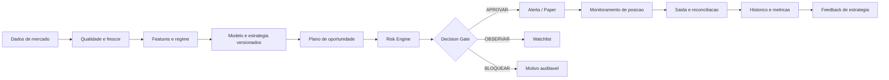

# Trade AI - Avaliacao de Produto e Arquitetura

Versao: 1.0  
Data: 2026-08-26  
Status: Documento de direcionamento para Product, Senior Developer e Arquiteto

## 1. Objetivo

Avaliar se as telas e os fluxos atuais do Trade AI estao alinhados ao negocio de analise, validacao e operacao controlada de estrategias de criptomoedas, identificar lacunas e transformar as conclusoes em um backlog executavel.

Este documento nao autoriza operacao real. O sistema permanece em modo de analise e paper trading ate que os controles descritos neste documento sejam implementados, testados e aprovados.

## 2. Tese executiva

O Trade AI esta tecnicamente mais maduro como **workspace de pesquisa quantitativa** do que como **sistema de decisao operacional**.

A base atual e consistente:

- dados de mercado reais e normalizados;
- indicadores e features deterministicas;
- modelos com registry e aprovacao;
- backtest causal e walk-forward;
- ranking de oportunidades com custos, slippage e edge;
- paper trading persistente com marcacao em tempo real;
- alertas condicionados a oportunidades e operacoes abertas;
- validacao contextual por LLM sem autoridade para alterar a decisao quantitativa.

A lacuna principal nao e falta de mais indicadores ou mais IA. E falta de uma camada explicita que consolide **qualidade, risco, estado operacional, decisao e auditoria** em um contrato unico.

A pergunta central de cada tela deve ser respondida sem interpretacao excessiva pelo usuario:

> Qual ativo, estrategia e plano estao elegiveis agora, por que, com qual risco, e o que deve acontecer em seguida?

## 3. Avaliacao geral

| Dimensao | Nota | Diagnostico |
| --- | ---: | --- |
| Fundacao tecnica | 8,5/10 | Separacao de camadas e contratos bem encaminhada |
| Pesquisa quantitativa | 8,5/10 | Backtest V2, walk-forward e gate de qualidade agregam valor real |
| Validacao economica | 8/10 | Custos, slippage, break-even e margem ja participam do ranking |
| Operacao paper | 7,5/10 | Fluxo funcional, mas ainda sem governanca de exposicao completa |
| Clareza de decisao | 6/10 | O usuario ainda precisa interpretar muitos sinais e metricas |
| Auditoria e explicabilidade | 5,5/10 | Faltam snapshots e motivos completos por decisao |
| Prontidao para LIVE | 3/10 | Nao deve ser habilitado sem Risk Engine, reconciliacao e kill switch |

## 4. Escopo atual confirmado

### 4.1 Telas e superficies

- `/dashboard`: Market Desk com ativo, timeframe, sinal, grafico, indicadores, order book e notificacoes.
- `/opportunities`: ranking das 20 moedas monitoradas, regime multi-timeframe, plano de entrada, stop, alvo, custos, probabilidade, EV e margem.
- `/strategy`: Strategy Lab com estrategias catalogadas, parametros, backtest V2 e walk-forward causal.
- `/paper`: abertura e fechamento virtual, PnL nao realizado em tempo real, grafico, posicoes abertas e historico paginado.
- `/models`: registry de candidatos e modelos ativos.
- `/news`: manchetes publicas filtradas por fonte.
- chat global: pesquisa contextual com MCP e provider Ollama/Groq.
- central de notificacoes: eventos de chat, oportunidades e eventos associados a operacoes paper.

### 4.2 Regras de negocio ja existentes

- O sistema nao envia ordens reais.
- Oportunidades fracas depois de custos sao excluidas.
- A probabilidade direcional precisa superar o break-even do setup.
- O valor esperado liquido precisa superar a margem de seguranca.
- Stop e alvo precisam ter distancia minima da entrada.
- O LLM e contextual e nao pode alterar score, preco, probabilidade ou decisao quantitativa.
- Alertas de stop/alvo sao direcionados a simbolos com posicao paper aberta.
- Modelos candidatos passam por metricas temporais, calibracao e estabilidade por regime.

## 5. Avaliacao por tela

### 5.1 Dashboard / Market Desk

**Papel de negocio:** centro de leitura do mercado e ponto inicial da jornada.

**O que esta adequado:**

- selecao de ativo e timeframe;
- dados de mercado e grafico;
- sinal quantitativo separado do contexto;
- indicadores e order book;
- notificacoes globais;
- ausencia de execucao automatica.

**Lacunas:**

- nao existe um veredito operacional consolidado;
- falta mostrar se existe estrategia validada para aquele ativo/timeframe;
- o sinal, o risco e a viabilidade economica aparecem separados;
- nao ha explicacao do motivo de um `WATCH` ou de uma rejeicao;
- o usuario nao visualiza a idade, qualidade e frescor dos dados como criterio de confianca.

**Direcao recomendada:** transformar o topo em um Decision Summary com estados `OPERAR`, `OBSERVAR`, `BLOQUEADO` e `DADOS INSUFICIENTES`, sempre acompanhado de motivos objetivos.

### 5.2 Opportunities

**Papel de negocio:** encontrar setups economicamente validos entre os ativos monitorados.

**O que esta adequado:**

- universo multiativo;
- ranking por valor esperado;
- entrada, stop e take profit;
- custos conservadores;
- lucro liquido minimo configuravel;
- break-even, edge, margem e required move;
- alinhamento multi-timeframe;
- link para abrir no Paper.

**Lacunas:**

- a tela ainda mistura descoberta, validacao e acao em uma lista;
- nao mostra de forma suficientemente forte quais gates reprovaram ativos excluidos;
- nao existe filtro por exposicao existente, correlacao ou limite de risco;
- nao ha validade/expiracao do setup;
- falta um identificador versionado da estrategia e do modelo que geraram a oportunidade;
- o ranking nao deve ser interpretado como recomendacao universal sem considerar o portfolio atual.

**Direcao recomendada:** apresentar cada oportunidade como um plano versionado com estado, validade, gates aprovados/reprovados, risco monetario, risco de portfolio e acao recomendada.

### 5.3 Strategy Lab

**Papel de negocio:** criar e validar hipoteses antes de usa-las no Paper.

**O que esta adequado:**

- estrategias de media movel, RSI e breakout;
- parametros configuraveis;
- multiplos ativos e timeframes;
- custos e slippage;
- stop ATR, alvo R/R e time exit;
- backtest causal;
- walk-forward fora da amostra;
- gate de robustez visivel;
- ajuda contextual nos campos.

**Lacunas:**

- ainda e um catalogo parametrizado, nao uma estrategia completamente customizavel;
- falta salvar cenarios, comparar versoes e promover uma configuracao;
- nao ha relacao explicita entre resultado do Lab, oportunidade e trade paper;
- falta mostrar amostra, significancia, distribuicao de retornos e sensibilidade dos parametros;
- o usuario pode ajustar parametros sem um limite de combinacoes ou controle de overfitting;
- falta um status de aprovacao de estrategia independente do modelo ML.

**Direcao recomendada:** criar um Strategy Definition versionado, com identidade, autor, parametros, universo, custos, resultados, gate, status e vinculo aos trades.

### 5.4 Paper Trading

**Papel de negocio:** validar o plano em condicoes de mercado sem risco financeiro real.

**O que esta adequado:**

- abertura e fechamento virtual;
- stream de precos e fallback por polling;
- PnL realizado e nao realizado;
- stop/alvo configurados;
- historico paginado;
- resumo de trades vencedores e perdedores;
- operacoes long e short.

**Lacunas:**

- falta saldo virtual, equity curve e limite de perda diario;
- exposicao e PnL sao mostrados, mas nao ha risco agregado por portfolio;
- falta registrar estrategia, modelo, versao, motivo e snapshot da oportunidade no trade;
- falta distinguir fechamento manual, stop, alvo, time exit e erro de dados de forma consistente na UI;
- nao ha validacao de stop/alvo em relacao ao lado da operacao suficientemente visivel;
- falta estado de mercado stale e comportamento definido quando o stream cai;
- historico ainda precisa de filtros por ativo, estrategia, periodo, direcao e motivo de saida.

**Direcao recomendada:** transformar Paper em ambiente de evidencia operacional, e nao apenas em livro de posicoes.

### 5.5 Model Registry

**Papel de negocio:** controlar qual modelo pode influenciar sinais.

**O que esta adequado:**

- candidatos e ativos;
- versionamento imutavel;
- metricas temporais;
- aprovacao administrativa;
- estabilidade por regime e calibracao no pipeline.

**Lacunas:**

- a tela exibe poucas metricas para aprovar ou rejeitar uma versao;
- nao mostra janela dos dados, quantidade de amostras, baseline ou motivo do gate;
- nao mostra a relacao entre modelo ativo e estrategias/oportunidades;
- falta historico de transicoes e usuario responsavel pela aprovacao;
- falta um estado explicito `degradado`, `expirado` ou `bloqueado`.

**Direcao recomendada:** tratar o registry como governanca de modelos, com decisao auditavel e impacto operacional visivel.

### 5.6 News

**Papel de negocio:** adicionar contexto de mercado e risco de evento.

**O que esta adequado:**

- fontes publicas identificadas;
- URL e data preservadas;
- filtros por fonte;
- atualizacao manual;
- enriquecimento deterministico existente no backend.

**Lacunas:**

- a tela ainda e um feed generico;
- falta associar noticia a ativo, evento, impacto, sentimento e confianca de forma visivel;
- nao ha janela temporal de relevancia para uma oportunidade;
- nao existe bloqueio ou aumento de risco diante de evento relevante;
- nao fica claro quando nao ha noticia relevante para o ativo.

**Direcao recomendada:** manter a noticia como contexto, mas transforma-la em risco contextual estruturado, sem permitir que o LLM invente causalidade.

### 5.7 Chat e notificacoes

**Papel de negocio:** consulta e acompanhamento, nao autoridade de trading.

**Lacunas principais:**

- provider Groq pode retornar `429`, portanto a experiencia precisa informar indisponibilidade e fallback;
- respostas devem exibir timestamp, fonte e escopo dos dados;
- chat nao deve parecer autorizar uma entrada;
- notificacoes precisam usar o mesmo contrato de viabilidade do painel;
- alertas devem ter severidade, deduplicacao, expiracao e estado lido/confirmado.

## 6. Fluxo de negocio alvo

O fluxo recomendado e:



Nenhuma tela deve pular diretamente de sinal para operacao. O plano precisa passar por qualidade, viabilidade, risco e estado do portfolio.

## 7. Contrato de decisao recomendado

Criar um objeto de dominio unico, chamado provisoriamente `DecisionAssessment`, consumido pelo Dashboard, Opportunities, Notifications e Paper:

```json
{
  "assessment_id": "uuid",
  "symbol": "BTCUSDT",
  "timeframe": "1h",
  "direction": "LONG",
  "status": "APPROVED",
  "action": "PAPER_ENTRY",
   "strategy_id": "moving_average",
   "strategy_version": "strategy-v1",
   "model_version": "model-v1",
  "entry_price": 100.0,
  "stop_price": 98.0,
  "target_price": 104.0,
  "net_target_pct": 0.035,
  "required_move_pct": 0.02,
  "expected_value_pct": 0.012,
  "risk_pct": 0.02,
  "portfolio_risk_pct": 0.04,
  "data_quality": "VALID",
  "regime": "TREND_UP",
  "expires_at": 0,
  "gates": {
    "data_quality": true,
    "model_approved": true,
    "strategy_robust": true,
    "cost_viable": true,
    "liquidity": true,
    "portfolio_limit": true
  },
  "reason_codes": ["NET_EDGE_ABOVE_REQUIRED_MOVE"],
  "created_at": 0
}
```

Os nomes finais devem seguir os contratos Python existentes, mas a ideia essencial e evitar que cada tela reconstrua sua propria interpretacao.

## 8. Backlog priorizado

### P0 - Controles obrigatorios antes de qualquer LIVE

1. **Decision Gate unico**
   - Consolidar qualidade de dados, modelo, estrategia, custos, liquidez, regime e portfolio.
   - Aceite: todas as telas exibem o mesmo status e os mesmos `reason_codes` para uma mesma avaliacao.

2. **Risk Engine de portfolio**
   - Saldo/equity virtual, risco por trade, exposicao por ativo, limite diario, limite por direcao e correlacao basica.
   - Aceite: uma oportunidade pode ser rejeitada mesmo com edge individual quando exceder o risco agregado.

3. **Auditoria de decisao**
   - Persistir snapshot de mercado, features, modelo, estrategia, parametros, gates, usuario e timestamp.
   - Aceite: um trade paper pode ser reproduzido e explicado sem depender do estado atual do mercado.

4. **Kill switch e estados de operacao**
   - Estados globais: `PAPER`, `TESTNET`, `LIVE_DISABLED`, `KILL_SWITCH`.
   - Aceite: falhas criticas bloqueiam abertura de novas operacoes e ficam visiveis no Dashboard.

5. **Reconciliacao e idempotencia paper**
   - Garantir que eventos repetidos de stream, polling ou fechamento nao dupliquem PnL.
   - Aceite: testes de repeticao e reconexao preservam uma unica transicao de estado.

### P1 - Centro de decisao e usabilidade operacional

6. **Decision Summary no Dashboard**
   - Mostrar acao, confianca, risco, motivo e validade do setup.
   - Aceite: o usuario identifica em poucos segundos se deve agir, observar ou evitar.

7. **Oportunidade versionada e expiravel**
   - Adicionar `assessment_id`, estrategia, modelo, validade e estado.
   - Aceite: alerta e tela apontam para o mesmo plano e um plano vencido nao pode ser aberto automaticamente.

8. **Paper com risco e performance completos**
   - Equity curve, drawdown atual, limite diario, PnL por ativo/estrategia e motivo de saida.
   - Aceite: o usuario consegue responder quanto arriscou, quanto perdeu e qual estrategia causou o resultado.

9. **Filtros e comparacao no historico**
   - Ativo, direcao, estrategia, periodo, resultado e motivo de saida.
   - Aceite: o historico paginado suporta investigacao de uma estrategia sem exportacao manual.

10. **Notificacoes operacionais consistentes**
    - Severidade, deduplicacao, validade, leitura e vinculo ao assessment.
    - Aceite: nenhuma notificacao apresenta dados diferentes do painel da oportunidade.

### P2 - Governanca de pesquisa e modelos

11. **Salvar e promover estrategias**
    - Strategy Definition versionado com autor, parametros, universo, custos e gate.
    - Aceite: uma configuracao usada em Paper sempre aponta para uma versao imutavel.

12. **Registry com explicacao de gate**
    - Exibir baseline, amostras, janela, calibracao, regimes, drawdown e motivo da aprovacao.
    - Aceite: admin consegue aprovar/rejeitar sem consultar logs.

13. **Analise de sensibilidade e overfitting**
    - Comparar vizinhanca de parametros, estabilidade por ativo/timeframe e custo.
    - Aceite: o Lab sinaliza quando o resultado depende de uma combinacao isolada.

14. **News Intelligence na operacao**
    - Associar noticia a ativo, impacto, confianca, frescor e possivel bloqueio contextual.
    - Aceite: noticia relevante aparece no mesmo assessment, sem alterar deterministicamente o preco ou score.

### P3 - Escala e evolucao

15. **Multi-broker via BrokerAdapter**
16. **Testnet com reconciliacao real**
17. **Prometheus/Alertmanager operacional**
18. **Permissoes por acao sensivel e trilha de auditoria administrativa**
19. **Retencao e particionamento de dados de mercado**
20. **Testes E2E de jornada completa**

## 9. Requisitos nao funcionais

### Confiabilidade

- Nenhuma decisao pode usar dado stale sem declarar esse estado.
- Queda do WebSocket deve acionar fallback, indicador visual e limite de confianca.
- Operacoes e notificacoes devem ser idempotentes.
- Erros do provider de IA nao podem bloquear nem alterar o motor quantitativo.

### Observabilidade

Toda decisao operacional deve carregar, no minimo:

- `correlation_id`;
- `assessment_id`;
- `signal_id`, quando aplicavel;
- `strategy_version`;
- `model_version`;
- latencia e idade dos dados;
- motivo de aprovacao ou rejeicao.

### Seguranca

- Manter `TRADING_MODE=PAPER` e `LIVE_TRADING_ENABLED=false` por padrao.
- Nunca expor chaves no frontend ou em logs.
- Aprovacao de modelo e mudanca de modo exigem role administrativa.
- LIVE exige confirmacao, kill switch, reconciliacao e testes de idempotencia.

### Performance

- Ranking das 20 moedas deve ter timeout definido e resposta parcial claramente marcada.
- Stream nao deve depender de polling para manter PnL atualizado quando estiver saudavel.
- Consultas de historico devem ser paginadas no backend, com indices adequados.

## 10. Criterios de prontidao para uso profissional

O produto nao deve ser considerado pronto para LIVE enquanto qualquer item abaixo estiver pendente:

- Risk Engine de portfolio implementado e testado;
- kill switch funcional;
- reconciliacao de ordens e estados;
- idempotencia comprovada;
- auditoria completa de cada decisao;
- paper trading com amostra e criterios de aprovacao definidos;
- testnet validada;
- estrategia e modelo versionados no trade;
- tratamento de dados stale, gaps e falhas de provider;
- alertas externos com severidade e deduplicacao;
- segredo e permissao revisados;
- testes E2E e testes de falha executados.

## 11. Plano de execucao sugerido

### Fase A - Contrato e risco

Implementar `DecisionAssessment`, Risk Engine, estados operacionais, auditoria e kill switch. Nao iniciar por redesign visual: as telas devem consumir o contrato que governa o negocio.

### Fase B - Dashboard e Opportunities

Exibir o veredito operacional, gates, validade, risco de portfolio e motivo da decisao. Unificar painel, alertas e acao para Paper.

### Fase C - Paper como evidencia

Adicionar equity, drawdown, risco por estrategia, motivos de saida, filtros e snapshot imutavel da entrada.

### Fase D - Governanca de estrategias e modelos

Versionar definicoes, promover configuracoes, comparar resultados e tornar aprovacoes auditaveis.

### Fase E - Testnet e preparacao futura

Somente depois das fases anteriores, implementar adapter de testnet, reconciliacao e ensaios de falha. LIVE continua desligado ate aprovacao formal.

## 12. Orientacao para o desenvolvedor senior/arquiteto

A implementacao deve preservar estas fronteiras:

- **Market Data:** coleta, normalizacao, frescor e qualidade.
- **Feature/ML:** calculo e predicao versionados.
- **Strategy Engine:** regras e parametros da estrategia.
- **Opportunity Engine:** plano economico e ranking.
- **Risk Engine:** risco individual e agregado.
- **Decision Gate:** aprovacao, observacao ou bloqueio.
- **Paper/Execution:** transicao de estado e reconciliacao.
- **Notification:** transporte de eventos, sem recriar regra de negocio.
- **UI:** apresentacao do contrato, sem recalcular decisoes criticas.

A regra mais importante e: **nenhuma tela deve possuir uma versao propria da verdade operacional**. O backend deve produzir o assessment e as telas devem apresenta-lo com clareza.

## 13. Conclusao

O Trade AI ja tem uma base diferenciada para pesquisa quantitativa e paper trading. Os maiores ganhos agora virao de governanca, consistencia e clareza de decisao, e nao da adicao indiscriminada de novos indicadores ou de mais chamadas ao LLM.

A recomendacao para a proxima equipe e executar primeiro o P0. Depois disso, o produto podera evoluir de um painel analitico para uma plataforma de decisao controlada, auditavel e preparada para validacao em testnet.
